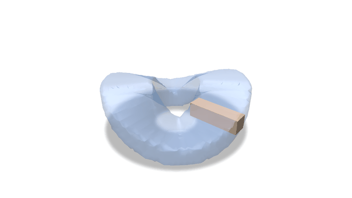

# Swept Volumes via Spacetime Numerical Continuation
Public code release for ["Swept Volumes via Spacetime Numerical Continuation"](http://dgp.toronto.edu/~sgsellan/pdf/swept-volumes.pdf), presented at SIGGRAPH 2021 and authored by [Silvia Sellán](http://dgp.toronto.edu/~sgsellan/), [Noam Aigerman](https://noamaig.github.io) and [Alec Jacobson](http://www.cs.toronto.edu/~jacobson/). Please note that while this implementation of our method is hereby released under MIT License, the method itself is pending a US patent filed in 2021 by Adobe Inc.

# Important note

An up-to-date, maintained version of this code is implemented into our new python geometry processing library [Gpytoolbox](https://gpytoolbox.org). See the swept volume documentation and examples [here](https://gpytoolbox.org/copyleft/swept_volume/).

# Python bindings (nanobind)

This repository also provides Python bindings built with
[nanobind](https://github.com/wjakob/nanobind). All dependencies (libigl v2.6.0
and Eigen) are fetched automatically via CMake — no submodules or system
installs required.



*A 3D cross swept along a cyclic orbit while twisting about its own axis. The
translucent surface is the computed swept volume; the solid cross is the input
shape animated along the trajectory. Generated by
[`python/example_polyscope.py`](python/example_polyscope.py).*

## Installation

```bash
pip install .            # builds the C++ core + extension via scikit-build-core
pip install .[test]      # also pulls pytest + numba

# for the animated demo below:
pip install numba polyscope imageio pillow
```

A C++17 compiler and CMake ≥ 3.20 are required; the first build fetches and
compiles libigl/Eigen and may take a few minutes.

## Defining the trajectory: zero-overhead `transform(t)`

The spacetime continuation evaluates the trajectory `transform(t)` an enormous
number of times. To keep that hot loop free of any Python / GIL / NumPy
overhead, write the transform in Python and compile it to native machine code
with [`numba.cfunc`](https://numba.readthedocs.io/en/stable/user/cfunc.html)
using the native ABI

```
void transform(double t, double *A, double *Adot)
```

where `A` and `Adot` point directly at the storage of the destination 4×4 pose
and its time-derivative (column-major, matching Eigen). The
[`@native_transform`](python/swept_volumes/__init__.py) decorator wires up the
`numba.farray` views for you:

```python
import math, numpy as np
import igl                                   # or any loader for V, F
from swept_volumes import native_transform, NativeTransform, swept_volume, ContouringMethod

@native_transform
def spin(t, A, Adot):
    # A, Adot are Fortran-order (column-major) 4x4 views.
    c, s = math.cos(t), math.sin(t)
    A[0, 0] = c;  A[0, 1] = -s; A[0, 3] = t
    A[1, 0] = s;  A[1, 1] = c
    A[2, 2] = 1.0; A[3, 3] = 1.0
    Adot[0, 0] = -s; Adot[0, 1] = -c; Adot[0, 3] = 1.0
    Adot[1, 0] = c;  Adot[1, 1] = -s

U, G, strobo_V, strobo_F = swept_volume(
    V, F, NativeTransform(spin),
    eps=0.02, num_seeds=100,
    contouring=ContouringMethod.MarchingCubes,   # or DualContouring
)
```

The function-pointer address (`cfunc.address`) is extracted once at the C++
boundary; every inner evaluation is then an ordinary indirect native call. The
`NativeTransform` object keeps the compiled `cfunc` alive for the duration of
the call, and the heavy computation runs with the GIL released.

Other entry points: `swept_volume_keyframes(V, F, [poses...])` (the original
keyframe trajectory), and `swept_volume_pyfunc(V, F, fn)` (a slow reference path
where `fn(t) -> (A, Adot)` is a plain Python callable — for debugging only).

## Per-call overhead

`python python/benchmark.py` measures the cost of one `transform(t)` evaluation:

| mechanism        | ns/call | vs C++ |
|------------------|--------:|-------:|
| C++ baseline     |   ~33   |  1.0×  |
| numba cfunc      |   ~28   |  0.8×  |
| python callable  | ~5900   | ~180×  |

The numba `cfunc` is a single indirect native call, indistinguishable from a
runtime C++ function pointer; a plain Python callable is ~180× slower. Output is
bit-identical across all three delivery mechanisms (see `tests/`).

## Animated demo

The GIF at the top is produced end-to-end by
[`python/example_polyscope.py`](python/example_polyscope.py): it defines a cyclic
`@native_transform` (a 3D cross that orbits while twisting about its own axis, with
an analytic pose *and* derivative), computes the swept volume, and renders it with
[polyscope](https://polyscope.run) — semi-transparent swept volume, soft ground
shadows, and the input shape animated along the trajectory. It runs headless (no
display needed) via polyscope's EGL backend:

```bash
python python/example_polyscope.py --gif assets/swept_volume_demo.gif
```

## Installation

To install this library, please start by cloning the repository recursively
```
git clone --recursive git@github.com:sgsellan/swept-volumes.git
```
After this, compile in release mode using `cmake` following the usual steps:
```
cd swept-volumes
mkdir build
cd build
cmake -DCMAKE_BUILD_TYPE=Release ..
make all -j8
```
If all goes right, you'll find the executable `swept-volumes-gui` in the main repository directory. If not, we provide a MacOS precompiled binary in `precompiled/osx/bin/swept-volumes-gui` that you can move to the main repository directory.

## Use

You can begin by running `./swept-volumes-gui` with no arguments. A viewer should appear showing a bunny:


You can then use W, E and R to flip between translation, rotation and scaling to move the bunny around.


Press "B" to bake a keyframe in. A copy of the bunny will appear fixed in the current position, and you can move the original bunny around to select your second keyframe:


Keep doing this until you are happy with the trajectory you've built:


Remember to press "B" to bake the last frame. Then, press "S" to run our algorithm to compute the swept volume. Wait for a couple of seconds (up to a minute in this example) and you'll see our output (this took 25s in my MacBook):


Press "V" to compare to a stamping algorithm with 10 stamps. Keep pressing "V" to see 100 stamps and 1000 stamps.


If you want to go back to our output, press "C". You can now close the viewer window, all the files have been saved to `data/experiments/dd-mm-hh-mm` in `.obj` format.

Once you have tried this demo, there are many arguments you can pass to our gui, in whichever order. `-i path/to/shape.obj` will change the input shape (any libigl-readable format is accepted and there are no requirements on manifold-ness or close-ness, default is `data/bunny.obj`), `-e number` changes the edge-length of the grid used in our algorithm (lower will be slower and more precise, default is `0.02`). A sample call may be
```
./swept-volumes-gui -i path/to/your/shape.obj -e 0.01
```

A particularly interesting argument is `-load`, by which we can load the parameters and trajectory of a previous experiment. When using `-load`, the order of arguments does matter: every argument after `-load` will overwrite the loaded one. For example,
```
./swept-volumes-gui -i data/armadillo.obj -load data/experiments/experiment-name/
```
will ignore the `-i data/armadillo.obj` part and load whichever input was used in `experiment-name` experiment. However,
```
./swept-volumes-gui -load data/experiments/experiment-name/ -i data/armadillo.obj 
```
will recreate `experiment-name` *but with the armadillo as input*. We can even add new keyframes when loading a previous experiment, or run the same experiment with a finer grid size:
```
./swept-volumes-gui -load data/experiments/experiment-name/ -e 0.01 
```


## Known Issues
This released code uses marching cubes as a surface generation algorithm, while our paper examples use dual contouring. I plan on adding dual contouring functionality to this repository soon when I manage to clean our original research code :-). All other elements in the algorithm are reproduced here exactly as were used to produce the examples in our paper.

Please do not hesitate to contact [sgsellan@cs.toronto.edu](mailto:sgsellan@cs.toronto.edu) if you find any issues or bugs in this code, or you struggle to run it in any way.
